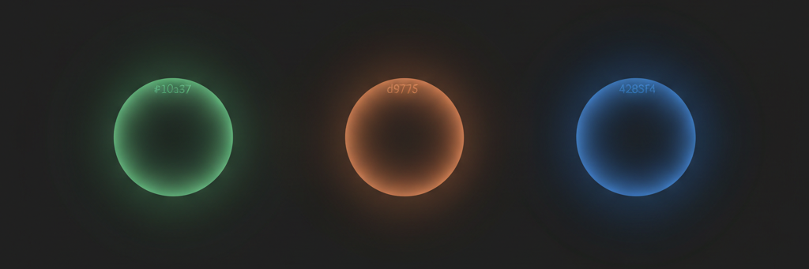
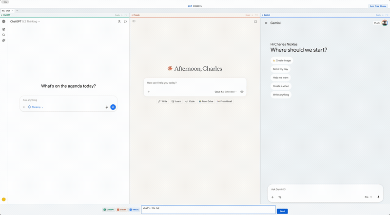

<div align="center">



# LLMux

**One input. Three models. Instant answers.**

Multiplex your queries across ChatGPT, Claude, and Gemini in a single window — or toggle down to just the one you need.

<br>



<br>

[Install](#install) · [Features](#features) · [Shortcuts](#keyboard-shortcuts) · [How It Works](#how-it-works)

</div>

---

## Install

```bash
brew install charlesnchr/tap/llmux
```

Or grab the `.dmg` from the [Releases](https://github.com/charlesnchr/llmux/releases) page. See [other install methods](#other-install-methods) below.

## Features

### Multiplexed queries

All three models in one frame, answering the same question. Resize panels by dragging the dividers between them. Compare reasoning, tone, and accuracy side by side.

### Single-model mode

Toggle off what you don't need with `Cmd+Shift+1/2/3`, or open the command palette and type "Show Only Claude." LLMux remembers your selection — new tabs automatically inherit whichever models you last had active.

### Tabbed conversations

`Cmd+T` opens a new tab with fresh sessions across all platforms. Tabs auto-rename based on conversation titles as responses come in. Run as many parallel threads as you want.

### Raycast integration

Install the bundled Raycast extension and query your models from anywhere on your Mac — without switching to LLMux first. It opens the app, creates a new tab, and fires the query to all active models in one step.

### Deep link protocol

Any app or script can trigger a query via the `llmux://` URL scheme:

```
open "llmux://query?text=explain%20the%20CAP%20theorem"
```

LLMux activates, opens a new tab, and sends the query to all enabled models.

### Command palette

`Cmd+K` (or `Cmd+/`) opens a fuzzy-search palette with every action in the app — toggle platforms, reload panels, rename tabs, switch themes, sync cookies.

### Cookie sync

Click **Sync from Chrome** to import your existing browser sessions. LLMux reads Chrome's encrypted cookie store via the macOS Keychain, so you don't need to log into each platform again.

### Theme support

Switch between Light, Dark, and System themes from the tab bar.

<div align="center">

</div>

## Keyboard Shortcuts

| Shortcut | Action |
|:--|:--|
| `Cmd+K` or `Cmd+/` | Command palette |
| `Cmd+L` | Focus query input |
| `Cmd+Shift+1` | Toggle ChatGPT |
| `Cmd+Shift+2` | Toggle Claude |
| `Cmd+Shift+3` | Toggle Gemini |
| `Cmd+Shift+R` | Reload all panels |
| `Cmd+N` | New chat (reset current tab) |
| `Cmd+T` | New tab |
| `Cmd+W` | Close tab |
| `Cmd+1`--`9` | Jump to tab |
| `Ctrl+Tab` / `Ctrl+Shift+Tab` | Next / previous tab |

Everything is also accessible through the command palette.

## How It Works

Each platform runs in an Electron `<webview>` with its own `persist:` session partition, so cookies and state are fully isolated between models.

When you press Send, platform-specific injection scripts locate the input field in each webview's DOM (handling contenteditable divs, ProseMirror editors, shadow DOM in Gemini), insert the query text, and programmatically click the send button.

The Raycast extension and deep links both use the `llmux://` custom URL protocol. The Electron app intercepts these URLs, creates a new tab, and injects the query.

Cookie import reads Chrome's encrypted SQLite cookie database on macOS, decrypts values using PBKDF2-derived keys from the Chrome Safe Storage keychain entry, and loads them into each webview's session.

## Other install methods

### Download

Grab the `.dmg` from the [Releases](https://github.com/charlesnchr/llmux/releases) page and drag to Applications. On first launch, if macOS blocks the app, run:

```bash
xattr -cr /Applications/LLMux.app
```

### From source

```bash
git clone https://github.com/charlesnchr/llmux.git
cd llmux
npm install
npx electron .
```

### Raycast extension

```bash
cd raycast-extension
npm install && npm run build
```

Then open Raycast, go to Extensions, and import the built extension from the directory.

### Requirements

- **macOS** (Apple Silicon) — cookie import uses the macOS Keychain
- **Chrome** — logged into the three platforms
- **Node.js 18+** (only needed when running from source)

## License

MIT
