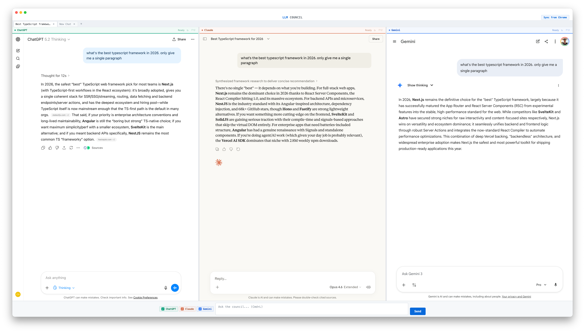
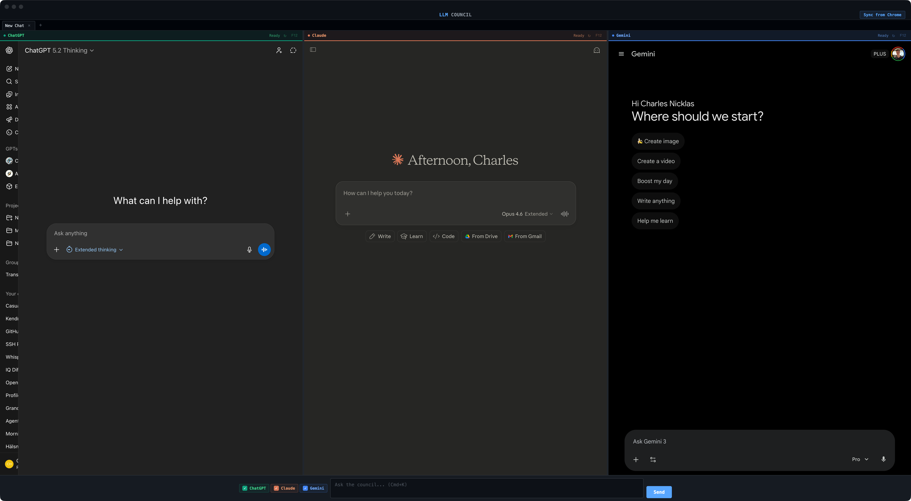

# LLM Council

Query ChatGPT, Claude, and Gemini simultaneously. Compare responses side-by-side in a single keyboard-driven Electron app.



## Why

Comparing LLM outputs means opening three browser tabs, copy-pasting the same prompt, and alt-tabbing between windows. LLM Council puts all three in one frame — type once, read three answers.

## Features

**Side-by-side panels** — ChatGPT, Claude, and Gemini each render in their own authenticated webview. Resize panels by dragging the dividers between them.

**Command palette** — `Cmd+K` opens a VS Code-style palette with fuzzy search. Toggle platforms, reload panels, rename tabs, switch tabs, open devtools — all without touching the mouse.


**Platform toggles** — Show or hide any combination of platforms. Toggle individually with `Cmd+Shift+1/2/3`, or use the command palette to show only one.

**Tabbed conversations** — Open multiple parallel conversations. Tabs auto-rename from the conversation title once responses arrive (priority: Claude > ChatGPT > Gemini). Rename manually via command palette.

**Cookie sync** — One-click import of cookies from your Chrome profile. No need to log in again — it reads your existing Chrome sessions (macOS, encrypted cookie store).

**Keyboard-driven** — Monospace UI, flat styling, minimal chrome. Every action has a keyboard shortcut or is reachable through the command palette.



## Keyboard Shortcuts

| Shortcut | Action |
|---|---|
| `Cmd+K` | Command palette |
| `Cmd+L` | Focus query input |
| `Cmd+Shift+1` | Toggle ChatGPT |
| `Cmd+Shift+2` | Toggle Claude |
| `Cmd+Shift+3` | Toggle Gemini |
| `Cmd+Shift+R` | Reload all panels |
| `Cmd+N` | New chat (reset current tab) |
| `Cmd+T` | New tab |
| `Cmd+W` | Close tab |
| `Cmd+1`–`9` | Jump to tab |
| `Ctrl+Tab` | Next tab |
| `Ctrl+Shift+Tab` | Previous tab |

## Getting Started

```bash
git clone https://github.com/charlesnchr/llm-council.git
cd llm-council
npm install
npx electron .
```

Requires Node.js and npm. On first launch, click **Sync from Chrome** to import your browser sessions — this pulls cookies from your active Chrome profile so you don't need to log in to each platform separately.

## How It Works

Each platform runs in an isolated Electron `<webview>` with its own persistent session partition. When you type a query and press Send (or Enter), injection scripts locate each platform's input field, insert the text, and click send — mimicking what you'd do manually.

Cookie import reads Chrome's encrypted SQLite cookie database on macOS, decrypts values using the Chrome Safe Storage keychain entry, and loads them into each webview's session.

## Requirements

- macOS (cookie import uses the macOS Keychain for Chrome decryption)
- Chrome installed and logged into ChatGPT, Claude, and Gemini
- Node.js 18+

## License

MIT
